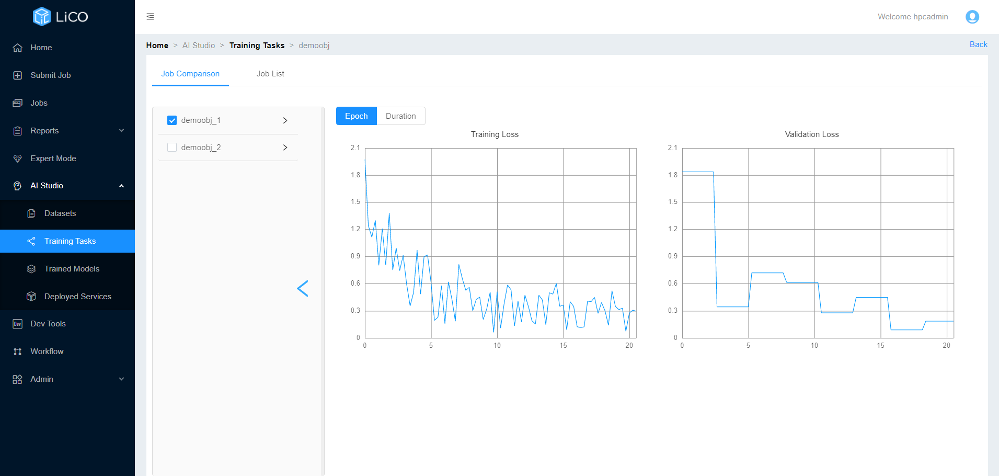
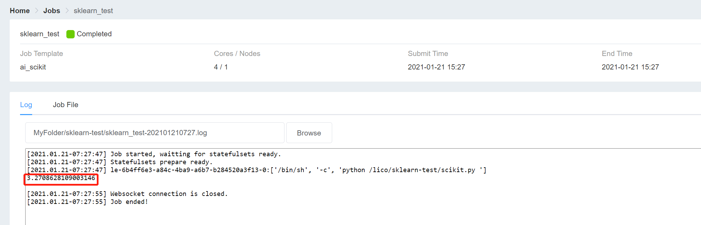

# Lico Machine Learning Cluster Service

**Lenovo Intelligent Computing Orchestration (LiCO) is a software solution that simplifies the use of clustered computing resources for Artificial Intelligence (AI) model development and training.**

Please select the option you would like to refer to:
+ [Introduction](#opt1)
+ [Lenovo Accelerated AI](#opt2)
+ [AI Studio](#opt3)
+ [Dev Tools](#opt4)
+ [Scikit Learn Example](#opt5)
+ [Contact us](#opt6)
 
 

### <a id='opt1'>Introduction
</a>

Lenovo Intelligent Computing Orchestration (LiCO) is a software solution that simplifies the use of clustered computing resources for Artificial Intelligence (AI) model development and training. LiCO interfaces with an open source software orchestration stack, enabling the convergence of AI onto an HPC or Kubernetes-based cluster.

The unified platform simplifies interaction with the underlying compute resources, enabling customers to take advantage of popular open source cluster tools while reducing the effort and complexity of using it for AI.

 

### <a id='opt2'>Lenovo Accelerated AI
</a>
Lenovo Accelerated AI provides a set of templates that aim to make AI training and inference simpler, more accessible, and faster to implement. The Accelerated AI templates differ from the other templates in LiCO in that they do not require the user to input a program; rather, they simply require a workspace (with associated directories) and a labelled dataset.
 
 

The dashboard interface composed by several components, such as the role management, recent activities, repositories list and organization list.

Each Lenovo Accelerated AI use-case is supported by both a training and inference template. The training templates provide parameter inputs such as batch size and learning rate. These parameter fields are pre-populated with default values, but are fully tunable by those with data science knowledge. The templates also provide visual analytics with TensorBoard; the TensorBoard graphs continually update in-flight as the job runs, and the final statistics are available after the job has completed.

The following figure displays the embedded TensorBoard interface for a job. TensorBoard provides visualizations for TensorFlow jobs running in LiCO, whether through Lenovo Accelerated AI templates or the standard TensorFlow AI templates.

LiCO also provides inference templates which allow users to predict with new data based on models that have been trained with Lenovo Accelerated AI templates. For the inference templates, users only need to provide a workspace, an input directory (the location of the data on which inference will be performed), an output directory, and the location of the trained model. The job will run, and upon completion, the output directory will contain the analyzed data. For visual templates such as Object Detection, images can be previewed directly from within LiCO’s Manage Files interface.

The following two figures display an input file to the Object Detection inference template, as well as the corresponding output.

 
 

### <a id='opt3'>AI Studio
</a>

LiCO AI Studio provides an end-to-end workflow for Image Classification, Object Detection, and Instance Segmentation, with training based on Lenovo Accelerated AI pre-defined models. A user can import an unprocessed, unlabeled data set of images, label them, train multiple instances with a grid of parameter values, test the output models for validation, and publish to a git repository for use in an application environment. Additionally, users can initiate the steps in AI Studio from a REST API call to take advantage of LiCO as part of a DevOps toolchain.

 
 

### <a id='opt4'>Dev Tools
</a>

LiCO includes the capability to create and deploy instances of Jupyter on the cluster. Users may create multiple instances, to customize for different software environments and projects. At launch of an instance the user can define the amount of compute resource requirements needed (CPU and GPU) to better optimize performance to the task and optimize resource usage on the cluster.

### <a id='opt5'>A Scikit-Learn Example
</a>
First create a folder for the job (e.g. "sklearn-test"), then upload the python file and data.
 
 

 

Lico Provide serval image docker node for different Machine Learning platform, to build a node please Go to "submit job" and select "industry Standard AI", Here we take scikit-learn as an example

Fill in the job information as required,please noted that job Name can contain only letters, digits, and underscores (_).

The Workspace is the working directory fo your program, if you use relative directory in your program, please do use the correct workspace.

You can either directly run the python or run a shell script since you may need to run serval program in one task or show the cpu/gpu info log.
Do rememeber to specified the python version you use (e.g. python3) in the shell script since python 2 and python 3 may exist at the same time in the docker.

A simple shell script example:
"python3 scikit.py"

After the job is submitted, you can check the status in "jobs", the log will contains the output of your program, here we take Boston real estate price estimation as an example. The mean_absolute_error of the prediction is shown as 3.27086

 

### <a id='opt6'>Contact us
</a>

Should you have any queries, please don’t hesitate to contact us.

Institute of Collaborative Innovation General Office: 
Campus Map, N21-1001 
Email: ICI.datasci@um.edu.mo 
Tel: (853) 8822 4600

 
 
